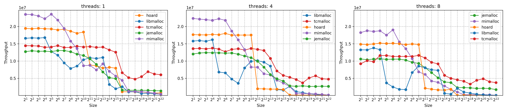

## What Are Memory Allocators?

Applications need memory to store data and code during runtime. Memory can be allocated statically (fixed size at compile time), or dynamically (at runtime). Dynamic memory allocation is crucial when the memory size needed varies during program execution, which is the case for most modern applications.

The stack and the heap are two key memory regions during program execution. Stack allocation is used for function calls and local variables and it happens automatically. The stack allocation lifecycle is tied to the lifecycle of the function. The heap is used for dynamic memory allocation. In non-garbage-collected languages like C++, the programmer is responsible for managing the heap, while in garbage-collected languages like Java, the heap is managed automatically.

In many cases, heap allocation and de-allocation is implemented via a memory allocator, which implements functions like `malloc` and `free`. Those generic functions are part of the C standard library, and are implemented by `libc`, which on Linux, is `glibc` by default for most installations. On MacOS, `libmalloc` is the default implementation.

In [Writing My Own Dynamic Memory Management](https://dev.to/frosnerd/writing-my-own-dynamic-memory-management-361g) I attempted to write a very simple allocator for my own operating system based on a doubly linked list. The following animation shows how the available heap is managed by the allocator:



Efficient memory allocation is a complex problem, especially on modern computer architectures. Modern allocators combine advanced data structures and algorithms to achieve high performance in concurrent environments.

Especially in performance critical applications, such as databases, webservers, and game engines, the choice of memory allocator can have a significant impact on performance. I wanted to learn more about the different allocators available. In this blog post we are going to compare a few well-known allocators on MacOS:

- [`libmalloc`](https://github.com/apple-opensource/libmalloc) - The default allocator on MacOS, developed by Apple.
- [`jemalloc`](https://github.com/jemalloc/jemalloc) - Created by Jason Evans originally for FreeBSD to address fragmentation and scaling issues, jemalloc is a scalable allocator widely adopted in performance-critical applications including Firefox and Facebook.
- [`tcmalloc`](https://github.com/google/tcmalloc) - Developed by Google as part of the [Google Performance Tools](https://github.com/gperftools/gperftools) to enhance multithreaded allocation speed and reduce lock contention using thread-local or core-local caches.
- [`mimalloc`](https://github.com/microsoft/mimalloc) - Developed by Microsoft Research as a modern general-purpose allocator, focusing on locality and reducing contention with innovations like page-local free lists and free list sharding for performance gains.
- [`hoard`](https://github.com/emeryberger/Hoard) - Designed by Emery Berger and his team at the University of Massachusetts to reduce memory fragmentation and contention in multithreaded systems by partitioning heaps per thread, introduced in the early 2000s as a research-driven allocator.

## Allocator Architecture

### Overview

All modern memory allocators share common architectural concepts to manage dynamic memory efficiently and safely. Allocation requests can come in different sizes, ranging from a few bytes to megabytes or even gigabytes. Allocators need to be equipped with strategies to handle different allocation sizes with minimal overhead and fragmentation. Commonly this is achieved by using some form of segmentation based on the requested size.

Allocators need to track the state of allocated and free memory. This is often done by using data structures that keeps track of the state of each memory block. Metadata can be tracked externally, in a separate data structure, or internally within the block, or a combination of both.

In multithreaded environments, concurrency control is necessary to ensure safety when allocating and deallocating memory. Synchronization negatively impacts performance, however, so modern allocators use various techniques to minimize synchronization overhead, e.g. by using thread-local data structures and even entire heap regions. Of course, these techniques come with additional memory overhead.

Let's look into the key architectural concepts of each allocator.

### `libmalloc`

- Uses multiple zones for different allocation sizes and allocation strategies.
- Stores metadata associated with each block for bookkeeping, including checksums for added memory corruption protection.
- Employs thread-local caching with per-thread magazines to reduce contention and improve concurrency.
- Implements allocation algorithms that search free lists or caches to find suitable blocks, and fall back to allocating new memory regions if needed.

### `jemalloc`

- Organizes allocations into predefined size classes. This organization reduces fragmentation by rounding requests up to the nearest size class and managing memory in runs dedicated to a single size class.
- Memory is allocated in larger extents (virtual memory segments), which are subdivided into smaller regions or blocks corresponding to each size class. This hierarchical design aids efficient memory reuse and reduces fragmentation.
- Uses arenas (independent allocation pools) reduce lock contention by allowing threads to allocate from different arenas concurrently. Each arena manages its own memory to avoid synchronization bottlenecks.
- Thread-local caching serves small allocations quickly without accessing the central arenas, which improves allocation speed and scalability.
- Delays returning memory to the OS to amortize overheads and groups related allocations to optimize memory layout and reduce fragmentation.

### `tcmalloc`

- Allocation requests are rounded up to the nearest size class to reduce fragmentation and speed indexing into caches and free lists.
- Per-CPU/per-thread Caches: Each CPU or thread has a local cache to serve most allocation and deallocation requests quickly without locking global structures. This reduces contention dramatically by localizing frequent operations.
- A central cache maintains free lists of memory blocks organized by size classes. It serves requests from the transfer cache and pulls memory from the backend heap if needed.
- Transfer caches act as an intermediate layer between per-thread caches and the central cache, designed to batch cache line transfers to minimize synchronization overhead.
- The backend heap allocator manages large contiguous chunks of memory called spans, which are divided into smaller blocks for allocation. It requests memory from the OS and handles returning unused memory back to the system.

### `mimalloc`

- Instead of a single large free list per size class, `mimalloc` uses many smaller free lists per `mimalloc` page (usually 64KiB) which contain blocks of a single size class. This significantly improves locality, reduces fragmentation, and increases allocation speed by keeping related allocations close in memory.
- Each thread can allocate from its own heap, but it can also safely free memory owned by other threads. Internally, a heap contains segments, and each segment contains multiple pages dedicated to blocks of the same size class.
- No locks, atomic operations only: To improve concurrency and scalability, `mimalloc` avoids locks by using atomic operations. It also separates free lists for frees performed by the owning thread and frees done by other threads, reducing contention drastically.
- When a page becomes empty, it is marked back to the OS as unused (reset or decommitted), reducing real memory usage and fragmentation.
- Supports advanced security modes that add guard pages around allocations, randomized allocation orders, encoded free list pointers, and guard page protections to mitigate heap overflow attacks and detect corruption.
- Supports multiple heaps that can be created and destroyed efficiently, allowing objects allocated from different heaps to be managed collectively.

### `hoard`

- Each processor (or thread) has its own private heap where it allocates memory from. This reduces lock contention since allocation and freeing mostly operate on the local heap.
- In addition to private heaps, there is a global heap used as a shared resource to balance memory usage across processors by transferring memory blocks (superblocks) between private heaps and the global heap.
- Memory is managed in large chunks called superblocks, subdivided into smaller blocks of the same size class. Each superblock is owned by one heap and serves its allocation requests.
- When a private heap becomes too empty or too full, superblocks are transferred to or from the global heap to maintain balanced memory usage and avoid excessive fragmentation.
- Hoard ensures that superblocks are allocated and reused mostly by the same processor to prevent false sharing at the cache-line level, which is a common concurrency performance problem.
- Each heap organizes superblocks into bins based on their fullness, favoring allocation from superblocks that are nearly full to improve locality and reduce fragmentation.
- Objects larger than half a superblock are allocated directly from the OS virtual memory system.

## Benchmarks

### What to Compare?

While the interface looks simple, the implementations of those allocators differ significantly. Different allocators have different performance characteristics, and are better suited for different workloads and computer architectures. When comparing allocators, there are several key performance indicators (KPIs) to consider:

- **Throughput** (ops/sec)
- **Latency** - (sec/op)
- **Memory usage** - (overhead and fragmentation)
- **Tooling** (debugging, profiling, leak checking, ...)

The workload (allocation size, frequency, number of threads, etc.) impacts these KPIs, so it is important to benchmark your specific workload.

### Benchmarking Setup

I'm running the benchmarks using Google Benchmark `v1.9.4` on my Nov 2023 MacBook Pro (M3) with MacOS `15.6.1`, compiled with Apple `clang-1700.0.13.5`. You can find the [source code](https://github.com/FRosner/malloc-post) on GitHub. 

While `libmalloc` is the default allocator on MacOS and part of `libSystem`, the other allocators are going to be installed via `brew`. Note that `tcmalloc` is part of `gperftools`, and `libhoard` is a custom tap (`brew tap emeryberger/hoard`). Here are the versions I am using:

```bash
# otool -L build/malloc-post-benchmark-libmalloc
/usr/lib/libSystem.B.dylib (compatibility version 1.0.0, current version 1351.0.0)
# brew info gperftools | grep Cellar
/opt/homebrew/Cellar/gperftools/2.17.2
# brew info jemalloc | grep Cellar
/opt/homebrew/Cellar/jemalloc/5.3.0
# brew info mimalloc | grep Cellar
/opt/homebrew/Cellar/mimalloc/3.1.5
# brew info emeryberger/hoard/libhoard | grep Cellar
/opt/homebrew/Cellar/libhoard/HEAD-5a7073f
```

I am using CMake to build the benchmark binaries for each allocator. The gist of the CMakeLists.txt is:

```cmake
set(MALLOC_IMPLEMENTATIONS jemalloc mimalloc hoard tcmalloc)
foreach(MALLOC ${MALLOC_IMPLEMENTATIONS})
    find_library(${MALLOC}_LIBRARY ${MALLOC})
    set(EXE_NAME "${PROJECT_NAME}-benchmark-${MALLOC}")
    add_executable(${EXE_NAME} src/main.cpp)
    target_link_libraries(${EXE_NAME} PRIVATE benchmark::benchmark pthread)
    target_link_libraries(${EXE_NAME} PRIVATE ${${MALLOC}_LIBRARY})
endforeach()
```

Note that we cannot actively "reset" the allocator between each benchmark run. To avoid interactions between runs, we'll use a bash script to run the individual benchmarks in a loop. Thanks to the `--benchmark_filter` command line option and the way Google Benchmark builds benchmark names, we can loop over different parameters for a given benchmark, restarting the binary after each run.

```bash
run_allocation_throughput_benchmark() {
  local size=$1
  local threads=$2
  echo "Running allocation throughput benchmark for ${MALLOC} with ${size} size, ${threads} threads"
  ${executable} --benchmark_filter="BM_AllocationThroughput/${size}/iterations:1000/threads:${threads}" \
    --benchmark_out="results/${MALLOC}_AllocationThroughput_${size}_${threads}.json" \
    > /dev/null
}

executable_prefix="./build/malloc-post-benchmark-"

for executable in ${executable_prefix}*; do
  MALLOC="${executable#./build/malloc-post-benchmark-}"
  for threads in 1 2 4 8; do
    for size in {1..22}; do
      run_allocation_throughput_benchmark $((2**size)) ${threads}
    done
  done
done
```

We are storing the results in JSON files, which we combine, analyze and visualize using [matplotlib](https://matplotlib.org/) in Python. Here's the structure of a benchmark result file:

```json
{
  "context": {
    "date": "2025-11-26T14:00:48+01:00",
    "host_name": "MyMacBook",
    "executable": "./build/malloc-post-benchmark-hoard",
    "num_cpus": 12,
    "mhz_per_cpu": 24,
    "cpu_scaling_enabled": false,
    "caches": [
      {
        "type": "Data",
        "level": 1,
        "size": 65536,
        "num_sharing": 0
      },
      {
        "type": "Instruction",
        "level": 1,
        "size": 131072,
        "num_sharing": 0
      },
      {
        "type": "Unified",
        "level": 2,
        "size": 4194304,
        "num_sharing": 1
      }
    ],
    "load_avg": [2.55762,2.97754,3.83203],
    "library_version": "v1.9.4",
    "library_build_type": "debug",
    "json_schema_version": 1
  },
  "benchmarks": [
    {
      "name": "BM_AllocationThroughput/2/iterations:1000/threads:1",
      "family_index": 0,
      "per_family_instance_index": 0,
      "run_name": "BM_AllocationThroughput/2/iterations:1000/threads:1",
      "run_type": "iteration",
      "repetitions": 1,
      "repetition_index": 0,
      "threads": 1,
      "iterations": 1000,
      "real_time": 5.1424708217382431e+04,
      "cpu_time": 5.1425000000000051e+04,
      "time_unit": "ns",
      "items_per_second": 1.9445794846864346e+07
    }
  ]
}
```

Now with the setup in place, let's look into the different KPIs in greater detail.

### Throughput

To measure throughput, we will design a benchmark that within each iteration, allocates memory of a given size for a fixed number of pointers (1000), then frees and reallocates memory for 1000 of these pointers at random, and finally frees all pointers. This yields a total of 2000 memory allocations and frees per iteration. For the throughput counter `SetItemsProcessed` we treat two `malloc` plus two `free` calls as one "item".

```cpp
static void BM_AllocationThroughput(benchmark::State& state) {
    size_t sz = size_t(state.range(0));
    size_t n = 1000;

    std::vector<void*> ptrs(n);

    for (auto _ : state) {
        std::mt19937 rng(std::hash<std::thread::id>{}(std::this_thread::get_id()));
        std::uniform_int_distribution<int> dist(0, n - 1);

        for (size_t i = 0; i < n; ++i) {
            ptrs[i] = malloc(sz);
            if (!ptrs[i]) state.SkipWithError("malloc failed");
        }
        benchmark::DoNotOptimize(ptrs);

        for (size_t i = 0; i < n; ++i) {
            int j = dist(rng);
            free(ptrs[j]);
            ptrs[j] = malloc(sz);
        }

        for (size_t i = 0; i < n; ++i) {
            free(ptrs[i]);
        }
    }

    state.SetItemsProcessed(state.iterations() * n);
}
```

We can then run the benchmark for different allocation sizes and different number of threads:

```cpp
BENCHMARK(BM_AllocationThroughput)
    ->RangeMultiplier(2)
    ->Range(1 << 1, 1 << 25)
    ->Iterations(1000)
    ->Threads(1)
    ->Threads(2)
    ->Threads(4)
    ->Threads(8);
```

We expect the allocation throughput per thread to decrease with increased parallelism due to the increased synchronization overhead. When plotting the throughput (average "items processed" per second per thread) for allocation sizes of 1KB, we can see that the throughput decreases across the board:

_implementation_threads_items_per_second_results.png)

We can also see that `hoard` has the highest throughput, more than 2x of what `mimalloc` achieves. This is only one data point, however, as we were looking at 1KB allocations. Let's look at the throughput for different allocation sizes and different number of threads:



As you can see, the different allocators have vastly different throughput characteristics across the different workloads. While both `hoard` and `mimalloc` perform very well for small allocations, their throughput decreases rapidly for allocations > 1KB. `tcmalloc` takes the lead for allocations > 1KB and maintains a steady throughput up to 32KB (2<sup>15</sup> bytes). `jemalloc` has the lowest throughput for smaller allocation sizes, but maintains a decent throughput especially with increased parallelism compared to `mimalloc`, `hoard`, and `libmalloc`.

The sharp drop in throughput for larger allocations in the different allocators can be explained by the way they handle them internally. `tcmalloc` for example handles small allocations within the per-CPU caches in the front-end, while larger allocations have to go through the central free list, increasing lock contention (see architecture diagram below, taken from the `tcmalloc` [design documentation](https://google.github.io/tcmalloc/design.html)). The thresholds depend on the page size and can be viewed in the [size class definitions](https://github.com/google/tcmalloc/blob/master/tcmalloc/size_classes.cc).


Next, let's take a look at the latency of the different allocators.

### Latency

For the latency benchmark, I was interested in the latency of the `malloc` call. To measure that, I used manual timing, measuring only the time spent in the `malloc` call:

```cpp
static void BM_AllocationLatency(benchmark::State& state) {
    size_t sz = size_t(state.range(0));

    for (auto _ : state) {
        state.PauseTiming();

        auto start = std::chrono::high_resolution_clock::now();
        void* ptr = malloc(sz);
        auto end = std::chrono::high_resolution_clock::now();

        if (!ptr) state.SkipWithError("malloc failed");

        auto elapsed = std::chrono::duration_cast<std::chrono::duration<double>>(end - start);
        state.SetIterationTime(elapsed.count());

        free(ptr);
        state.ResumeTiming();
    }
}
```

Since the latency difference between small and large allocations is in orders of magnitude, I will plot small (<= 1KB) and larger (> 1KB) results separately:

_implementation_size_real_time_results.png)
_implementation_size_real_time_results.png)

We can see that all allocators perform small allocations within 20-30ns, except for `tcmalloc` in the face of a larger amount of threads and very small (<= 64B) allocation sizes.

For larger allocations in a single-threaded environment, all allocators perform reasonably well. Only `mimalloc` starts to experience a significant latency increase for allocations > 64KB. When multiple threads come into play, hoard experiences a significant latency increase for allocations between 2KB and 32KB.

### Memory Usage

- Two types of overhead:
  - allocation overhead when allocation size is not aligned with internal page size
  - bookkeeping / synchronization overhead (can be per thread, per core, per pointer)

Allocation overhead varies a lot between implementations.

- You can see zones / size class boundaries in the overhead. 
  - libmalloc: https://github.com/apple-oss-distributions/libmalloc/blob/d876784c79e2869ff1cce519f46905c49117f9a6/src/thresholds.h
    - TINY zone handles allocations up to 1008 bytes (~ 2<sup>10</sup> bytes).
    - SMALL zone handles allocations from above TINY up to 32 KB (2<sup>15</sup> bytes).
    - MEDIUM zone handles allocations from above SMALL up to 8 MB (2<sup>23</sup> bytes).
    - LARGE zone handles allocations beyond the MEDIUM threshold.
  - hoard: https://www.oracle.com/technical-resources/articles/it-infrastructure/dev-mem-alloc.html
    - Any allocation bigger than one half of a superblock or 32 KB will count as an oversize allocation, using `mmap` directly, bypassing the per-CPU cache.


```cpp
void* ptr = malloc(sz);
size_t actual = malloc_size(ptr);
size_t overhead = actual - sz;
```


- 
- Overall memory overhead varies significantly, with mimalloc having the lower overhead
  

### Tooling

#### "Tunability"

- https://google.github.io/tcmalloc/stats.html#page-sizes
- https://google.github.io/tcmalloc/tuning.html

#### Malloc Stats

- https://google.github.io/tcmalloc/stats.html

```
MALLOCSTATS=1 build/malloc-post-tcmalloc --benchmark_filter="BM_AllocationThroughput/2048/threads:8"
```

-------------------------------------------------------------------------------------------------
Benchmark                                       Time             CPU   Iterations UserCounters...
-------------------------------------------------------------------------------------------------
BM_AllocationThroughput/2048/threads:8      88255 ns        87151 ns         8304 items_per_second=11.4743M/s
------------------------------------------------
MALLOC:          42592 (    0.0 MiB) Bytes in use by application
MALLOC: +     12697600 (   12.1 MiB) Bytes in page heap freelist
MALLOC: +      1905528 (    1.8 MiB) Bytes in central cache freelist
MALLOC: +      1057024 (    1.0 MiB) Bytes in transfer cache freelist
MALLOC: +      2123048 (    2.0 MiB) Bytes in thread cache freelists
MALLOC: +      2621504 (    2.5 MiB) Bytes in malloc metadata
MALLOC:   ------------
MALLOC: =     20447296 (   19.5 MiB) Actual memory used (physical + swap)
MALLOC: +            0 (    0.0 MiB) Bytes released to OS (aka unmapped)
MALLOC:   ------------
MALLOC: =     20447296 (   19.5 MiB) Virtual address space used
MALLOC:
MALLOC:            451              Spans in use
MALLOC:              1              Thread heaps in use
MALLOC:           8192              Tcmalloc page size
------------------------------------------------

#### Heap profiling

```
HEAPPROFILE=malloc-post-tcmalloc.hprof build/malloc-post-tcmalloc --benchmark_filter="BM_AllocationThroughput/2048/threads:8"
pprof --web gfs_master malloc-post-tcmalloc.hprof.0001.heap
pprof --base=malloc-post-tcmalloc.hprof.0005.heap --web gfs_master malloc-post-tcmalloc.hprof.0001.heap
```

#### Heap checking

https://goog-perftools.sourceforge.net/doc/heap_checker.html

```
HEAPCHECK=normal ./build/malloc-post-leak-tcmalloc
```

Not working on MacOS

### Real World Scenario

C* libmalloc vs jemalloc

## Security?

TODO https://www.perplexity.ai/search/please-compare-the-security-po-zpOxKDs0SMWPLlaOwGsBTw

## Summary and Conclusion

While `hoard` shines in certain areas, it does not appear to be a good "default" choice, as it does not have steady performance characteristics across different allocation sizes and number of threads. It also does not appear to be actively maintained.

`mimalloc` works well for smaller allocations, but suffers in both latency and throughput for larger allocations. The advanced security features might be a unique selling point for some users though.

`tcmalloc` and `jemalloc` have the most stable performance characteristics across different allocation sizes and number of threads. The throughput remains reasonably high even at large allocation sizes, while latency remains within acceptable boundaries, with `jemalloc` winning in latency and `tcmalloc` winning in throughput for very large allocations. Among the ones I tested, those would be my preferred choice for applications with high performance requirements.

------------

- jemalloc widely used in high performance databases (C*, ClickHouse)
- compare different allocators
- compare throughput
- compare other metrics
  - memory footprint and overhead
  - memory fragmentation
  - latency
- compare tooling (debugging, profiling, etc.)
  - heap profiling / telemetry API?
  - memory debugging (double free)
- compare jemalloc performance across different sizes with 8 threads
- TODO https://github.com/google/benchmark/issues/178

### TCMalloc

- https://google.github.io/tcmalloc/overview.html
- https://google.github.io/tcmalloc/design.html
- https://stackoverflow.com/questions/76102375/what-are-rseqs-restartable-sequences-and-how-to-use-them
- TC = "thread caching"
- two modes: cache per thread, or cache per logical core
- In both cases, these cache implementations allows TCMalloc to avoid requiring locks for most memory allocations and deallocations.

## Results

- Ratio for {'threads': 8, 'size': 1024} {'implementation': 'tcmalloc'} / {'implementation': 'libmalloc'}: 1.3716038584770054 items_per_second/items_per_second
- Ratio for {'threads': 8, 'size': 1048576} {'implementation': 'tcmalloc'} / {'implementation': 'libmalloc'}: 20.009644120772688 items_per_second/items_per_second


For a database, the allocator choice affects throughput, latency tails, memory footprint, and operational behavior over long uptimes, so the key is to match the allocator’s behavior to your workload and SLOs.​

Workload and allocation patterns
Characterize the typical allocation sizes (tiny, small, large), object lifetimes, and locality patterns of your DB (buffer cache, query executor, background threads, etc.), since different allocators optimize for different size classes and lifetimes.​

High‑throughput DBs often show that the same code compiled against different allocators can vary by 10–50% in query throughput and latency, depending on the allocator’s fit to the workload.​

Throughput under concurrency
For many‑core servers, lock contention in the allocator can dominate, so you want per‑thread or sharded heaps and low cross‑thread contention; jemalloc, tcmalloc, mimalloc and similar “high‑perf” allocators were designed for this.​

Micro‑ and macro‑benchmarks on MySQL, LevelDB, RocksDB, and other engines consistently show better scalability from jemalloc/tcmalloc vs classic glibc malloc at high thread counts, with notably higher QPS and better parallel speedup.​

Latency and tail behavior
Look at p95–p99 latency impact, not just average throughput, because some allocators introduce long internal pauses (global locks, arena rebalancing, page reclamation) that show up as query latency spikes.​

Experimental studies on OLAP/OLTP workloads show that certain glibc malloc versions can have much worse tail latencies than jemalloc or mimalloc under bursty request loads, even when median latency is similar.​

Fragmentation and memory footprint
Long‑running DBs with mixed allocation sizes are prone to fragmentation; allocators differ significantly here, with some trading higher virtual and RSS usage for speed, and others being more compact but slightly slower.​

In practice, swapping from a default malloc to jemalloc or tcmalloc has reduced DB memory usage by multiple GiB on 16 GiB systems, but some experiments also show jemalloc consuming more memory than glibc in specific analytic workloads, so this must be measured for your case.​

Returning memory to the OS
Some allocators are aggressive about keeping arenas and pages for reuse and only reluctantly return memory to the OS, which can be good for performance but bad for multi‑tenant environments or dynamic workloads.​

Others (or specific configuration modes) are more eager to hand memory back to the kernel, improving coexistence with other services at the cost of more page faults and occasional allocator work spikes.​

Threading model and pools
If the DB uses mostly static worker threads (typical for thread pools), allocators with per‑thread caches (like jemalloc’s per‑thread arenas) work very well and minimize contention.​

If threads are frequently created and destroyed, an allocator whose design tolerates or optimizes for shifting thread ownership of caches (e.g., tcmalloc’s shared central cache model) can behave better and avoid cache blow‑up or many cold per‑thread heaps.​

Introspection and tuning knobs
Modern allocators expose detailed stats and profiling (fragmentation, size‑class usage, per‑arena counts), which are extremely useful for diagnosing odd memory behavior in a production DB.​

Many provide tunables for arena count, decay policies, large allocation thresholds, and security hardening; being able to tune these without code changes is valuable for tailoring to different deployments.​

Integration with DB design
For core, high‑traffic subsystems (buffer pool, query execution, caching), consider using custom arenas/pools on top of the general allocator so hot paths avoid generic malloc as much as possible.​

Where lifetimes are structured (per‑query, per‑transaction, per‑snapshot), region/arena allocators that free in bulk at scope end can outclass any general‑purpose malloc in both speed and fragmentation, reserving the global allocator mainly for long‑lived structures.​

Stability, maturity, and ecosystem usage
Prefer allocators that are widely deployed in similar production systems (e.g., major DBs, caches, cloud services) because their corner cases have been exercised and patched.​

Projects like Redis, Varnish and large cloud services have reported significant improvements in stability and resource usage after switching from the system malloc to jemalloc or tcmalloc, which is a useful signal when choosing.​

Operational considerations
Ensure observability: can you attribute leaks or runaway growth to subsystems, and does the allocator’s tooling integrate with your existing profiling and monitoring stack.​

Consider security and hardening options (guard pages, randomized layouts, secure modes) and balance them against performance overhead for your threat model and deployment environment.​

Evaluation methodology
Always benchmark your specific DB workload with candidate allocators using realistic schemas, queries, and concurrency, capturing throughput, p95/p99 latency, RSS/VSZ, fragmentation metrics, and page‑fault behavior over long uptimes.​

Test behavior under overload and pathological patterns (e.g., many concurrent connections doing allocations, large batch loads, heavy churn) to catch allocator‑induced stalls or memory bloat before committing to one choice.​