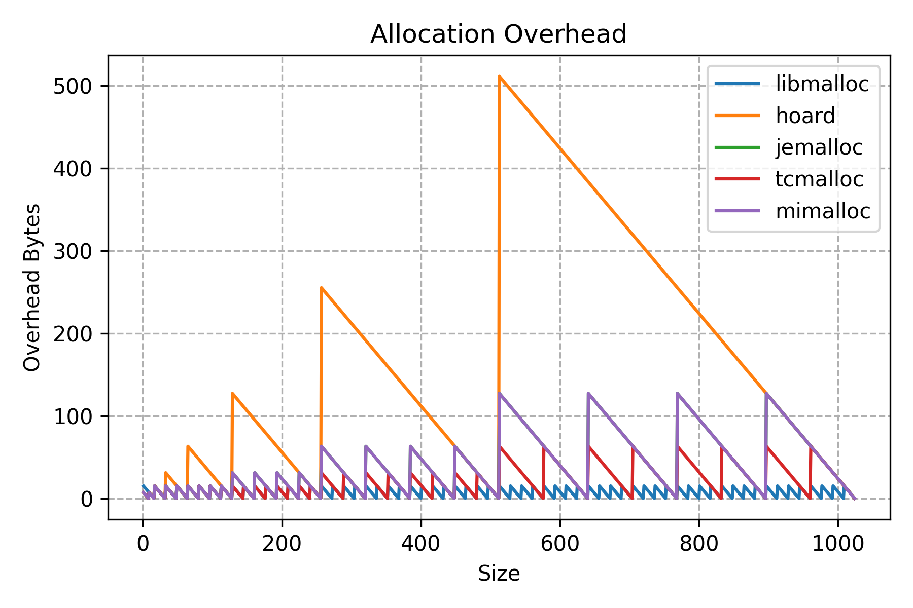
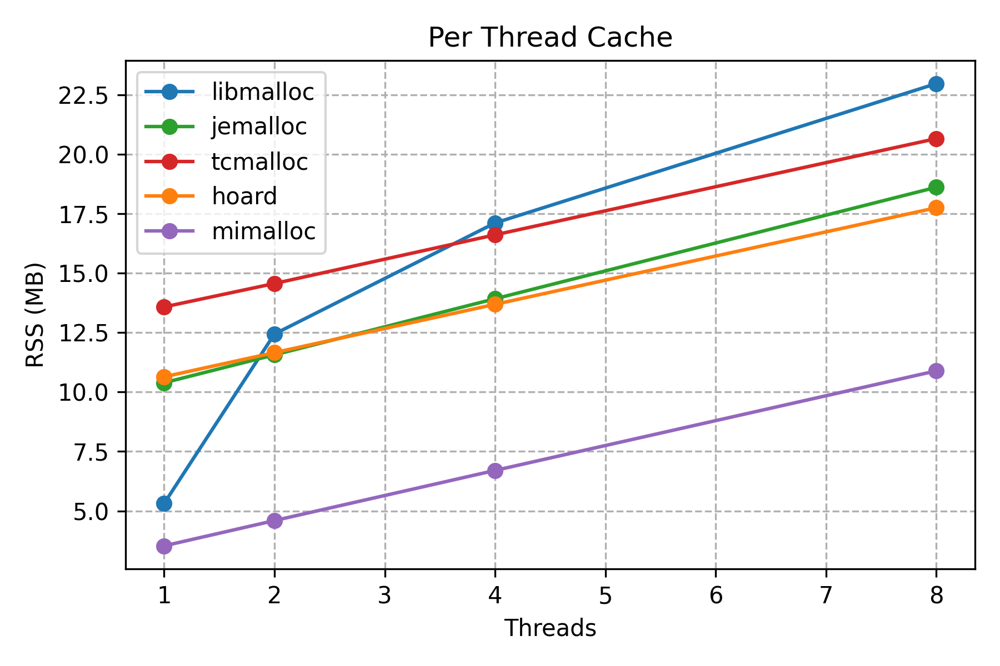

## What Are Memory Allocators?

Applications need memory to store data and code during runtime. Memory can be allocated statically (fixed size at compile time), or dynamically (at runtime). Dynamic memory allocation is crucial when the memory size needed varies during program execution, which is the case for most modern applications.

The stack and the heap are two key memory regions during program execution. Stack allocation is used for function calls and local variables and it happens automatically. The stack allocation lifecycle is tied to the lifecycle of the function. The heap is used for dynamic memory allocation. In non-garbage-collected languages like C++, the programmer is responsible for managing the heap, while in garbage-collected languages like Java, the heap is managed automatically.

In many cases, heap allocation and de-allocation is implemented via a memory allocator, which implements functions like `malloc` and `free`. Those generic functions are part of the C standard library, and are implemented by `libc`, which on Linux, is `glibc` by default for most installations. On MacOS, `libmalloc` is the default implementation.

In [Writing My Own Dynamic Memory Management](https://dev.to/frosnerd/writing-my-own-dynamic-memory-management-361g) I attempted to write a very simple allocator myself for my own operating system. Note that modern allocators are very complex, combining advanced data structures and algorithms achieve high performance in modern concurrent applications.

Especially in performance critical applications, such as databases, webservers, and game engines, the choice of memory allocator can have a significant impact on performance. I wanted to learn more about the different allocators available. In this blog post we are going to compare a few well-known allocators on MacOS:

- [`libmalloc`](https://github.com/apple-opensource/libmalloc) - The default allocator on MacOS, developed by Apple.
- [`jemalloc`](https://github.com/jemalloc/jemalloc) - Created by Jason Evans originally for FreeBSD to address fragmentation and scaling issues, jemalloc is a scalable allocator widely adopted in performance-critical applications including Firefox and Facebook.
- [`tcmalloc`](https://github.com/google/tcmalloc) - Developed by Google as part of the [Google Performance Tools](https://github.com/gperftools/gperftools) to enhance multithreaded allocation speed and reduce lock contention using thread-local or core-local caches.
- [`mimalloc`](https://github.com/microsoft/mimalloc) - Developed by Microsoft Research as a modern general-purpose allocator, focusing on locality and reducing contention with innovations like page-local free lists and free list sharding for performance gains.
- [`hoard`](https://github.com/emeryberger/Hoard) - Designed by Emery Berger and his team at the University of Massachusetts to reduce memory fragmentation and contention in multithreaded systems by partitioning heaps per thread, introduced in the early 2000s as a research-driven allocator.

## Allocator Architecture

### `libmalloc`

- Multiple zones for [different allocation sizes](https://github.com/apple-oss-distributions/libmalloc/blob/d876784c79e2869ff1cce519f46905c49117f9a6/src/thresholds.h) and allocation strategies (e.g. Nano zone optimized for tiny allocations).
- Use of metadata associated with each block for bookkeeping, including checksums for added memory corruption protection.
- Thread-local caching with per-thread magazines to reduce contention and improve concurrency.
- Allocation algorithms that search free lists or cache to find suitable blocks, fall back to allocating new memory regions if needed.


### `jemalloc`

`jemalloc` is a scalable memory allocator designed to reduce fragmentation and efficiently support multithreaded environments. Its architecture is built around the concepts of arenas, thread caches, size classes, and memory chunks organized in a hierarchical manner to maximize concurrency and minimize contention.

### `tcmalloc`

### `mimalloc`

### `hoard`

## Comparison

### What to Compare?

While the interface looks simple (in the end you are allocating, deallocating, sometimes resizing memory), the implementations of those allocators differ significantly. Different allocators have different performance characteristics, and are better suited for different workloads and computer architectures.

When comparing different allocators, there are several key factors to consider:

- **Throughput** (ops/sec)
- **Latency** - (sec/op)
- **Concurrency** - (synchronization)
- **Memory overhead** - (memory used per allocation)
- **Memory fragmentation** (memory wasted over time)
- **Tooling** (debugging, profiling, leak checking)

### Throughput

### Latency

### Memory Usage

- Two types of overhead:
  - allocation overhead when allocation size is not aligned with internal page size
  - bookkeeping / synchronization overhead (can be per thread, per core, per pointer)

Allocation overhead varies a lot between implementations, ranging from a static 16 bytes only (liballoc), to a whopping 100% of the allocated size (hoard).

TODO check with even larger sizes

```cpp
void* ptr = malloc(sz);
size_t actual = malloc_size(ptr);
size_t overhead = actual - sz;
```



- All allocators but liballoc have stable overhead with an increasing number of threads
- Overall memory overhead varies significantly, with mimalloc having the lower overhead
  


### Tooling

#### Malloc Stats

```
MALLOCSTATS=1 build/malloc-post-tcmalloc --benchmark_filter="BM_AllocationThroughput/2048/threads:8"
```

-------------------------------------------------------------------------------------------------
Benchmark                                       Time             CPU   Iterations UserCounters...
-------------------------------------------------------------------------------------------------
BM_AllocationThroughput/2048/threads:8      88255 ns        87151 ns         8304 items_per_second=11.4743M/s
------------------------------------------------
MALLOC:          42592 (    0.0 MiB) Bytes in use by application
MALLOC: +     12697600 (   12.1 MiB) Bytes in page heap freelist
MALLOC: +      1905528 (    1.8 MiB) Bytes in central cache freelist
MALLOC: +      1057024 (    1.0 MiB) Bytes in transfer cache freelist
MALLOC: +      2123048 (    2.0 MiB) Bytes in thread cache freelists
MALLOC: +      2621504 (    2.5 MiB) Bytes in malloc metadata
MALLOC:   ------------
MALLOC: =     20447296 (   19.5 MiB) Actual memory used (physical + swap)
MALLOC: +            0 (    0.0 MiB) Bytes released to OS (aka unmapped)
MALLOC:   ------------
MALLOC: =     20447296 (   19.5 MiB) Virtual address space used
MALLOC:
MALLOC:            451              Spans in use
MALLOC:              1              Thread heaps in use
MALLOC:           8192              Tcmalloc page size
------------------------------------------------


#### Heap profiling

```
HEAPPROFILE=malloc-post-tcmalloc.hprof build/malloc-post-tcmalloc --benchmark_filter="BM_AllocationThroughput/2048/threads:8"
pprof --web gfs_master malloc-post-tcmalloc.hprof.0001.heap
pprof --base=malloc-post-tcmalloc.hprof.0005.heap --web gfs_master malloc-post-tcmalloc.hprof.0001.heap
```

#### Heap checking

https://goog-perftools.sourceforge.net/doc/heap_checker.html

```
HEAPCHECK=normal ./build/malloc-post-leak-tcmalloc
```

Not working on MacOS

## Summary and Conclusion

------------

- jemalloc widely used in high performance databases (C*, ClickHouse)
- compare different allocators
- compare throughput
- compare other metrics
  - memory footprint and overhead
  - memory fragmentation
  - latency
- compare tooling (debugging, profiling, etc.)
  - heap profiling / telemetry API?
  - memory debugging (double free)
- compare jemalloc performance across different sizes with 8 threads
- TODO https://github.com/google/benchmark/issues/178

### TCMalloc

- https://google.github.io/tcmalloc/overview.html
- https://google.github.io/tcmalloc/design.html
- https://stackoverflow.com/questions/76102375/what-are-rseqs-restartable-sequences-and-how-to-use-them
- TC = "thread caching"
- two modes: cache per thread, or cache per logical core
- In both cases, these cache implementations allows TCMalloc to avoid requiring locks for most memory allocations and deallocations.

## Results

- Ratio for {'threads': 8, 'size': 1024} {'implementation': 'tcmalloc'} / {'implementation': 'libmalloc'}: 1.3716038584770054 items_per_second/items_per_second
- Ratio for {'threads': 8, 'size': 1048576} {'implementation': 'tcmalloc'} / {'implementation': 'libmalloc'}: 20.009644120772688 items_per_second/items_per_second


For a database, the allocator choice affects throughput, latency tails, memory footprint, and operational behavior over long uptimes, so the key is to match the allocator’s behavior to your workload and SLOs.​

Workload and allocation patterns
Characterize the typical allocation sizes (tiny, small, large), object lifetimes, and locality patterns of your DB (buffer cache, query executor, background threads, etc.), since different allocators optimize for different size classes and lifetimes.​

High‑throughput DBs often show that the same code compiled against different allocators can vary by 10–50% in query throughput and latency, depending on the allocator’s fit to the workload.​

Throughput under concurrency
For many‑core servers, lock contention in the allocator can dominate, so you want per‑thread or sharded heaps and low cross‑thread contention; jemalloc, tcmalloc, mimalloc and similar “high‑perf” allocators were designed for this.​

Micro‑ and macro‑benchmarks on MySQL, LevelDB, RocksDB, and other engines consistently show better scalability from jemalloc/tcmalloc vs classic glibc malloc at high thread counts, with notably higher QPS and better parallel speedup.​

Latency and tail behavior
Look at p95–p99 latency impact, not just average throughput, because some allocators introduce long internal pauses (global locks, arena rebalancing, page reclamation) that show up as query latency spikes.​

Experimental studies on OLAP/OLTP workloads show that certain glibc malloc versions can have much worse tail latencies than jemalloc or mimalloc under bursty request loads, even when median latency is similar.​

Fragmentation and memory footprint
Long‑running DBs with mixed allocation sizes are prone to fragmentation; allocators differ significantly here, with some trading higher virtual and RSS usage for speed, and others being more compact but slightly slower.​

In practice, swapping from a default malloc to jemalloc or tcmalloc has reduced DB memory usage by multiple GiB on 16 GiB systems, but some experiments also show jemalloc consuming more memory than glibc in specific analytic workloads, so this must be measured for your case.​

Returning memory to the OS
Some allocators are aggressive about keeping arenas and pages for reuse and only reluctantly return memory to the OS, which can be good for performance but bad for multi‑tenant environments or dynamic workloads.​

Others (or specific configuration modes) are more eager to hand memory back to the kernel, improving coexistence with other services at the cost of more page faults and occasional allocator work spikes.​

Threading model and pools
If the DB uses mostly static worker threads (typical for thread pools), allocators with per‑thread caches (like jemalloc’s per‑thread arenas) work very well and minimize contention.​

If threads are frequently created and destroyed, an allocator whose design tolerates or optimizes for shifting thread ownership of caches (e.g., tcmalloc’s shared central cache model) can behave better and avoid cache blow‑up or many cold per‑thread heaps.​

Introspection and tuning knobs
Modern allocators expose detailed stats and profiling (fragmentation, size‑class usage, per‑arena counts), which are extremely useful for diagnosing odd memory behavior in a production DB.​

Many provide tunables for arena count, decay policies, large allocation thresholds, and security hardening; being able to tune these without code changes is valuable for tailoring to different deployments.​

Integration with DB design
For core, high‑traffic subsystems (buffer pool, query execution, caching), consider using custom arenas/pools on top of the general allocator so hot paths avoid generic malloc as much as possible.​

Where lifetimes are structured (per‑query, per‑transaction, per‑snapshot), region/arena allocators that free in bulk at scope end can outclass any general‑purpose malloc in both speed and fragmentation, reserving the global allocator mainly for long‑lived structures.​

Stability, maturity, and ecosystem usage
Prefer allocators that are widely deployed in similar production systems (e.g., major DBs, caches, cloud services) because their corner cases have been exercised and patched.​

Projects like Redis, Varnish and large cloud services have reported significant improvements in stability and resource usage after switching from the system malloc to jemalloc or tcmalloc, which is a useful signal when choosing.​

Operational considerations
Ensure observability: can you attribute leaks or runaway growth to subsystems, and does the allocator’s tooling integrate with your existing profiling and monitoring stack.​

Consider security and hardening options (guard pages, randomized layouts, secure modes) and balance them against performance overhead for your threat model and deployment environment.​

Evaluation methodology
Always benchmark your specific DB workload with candidate allocators using realistic schemas, queries, and concurrency, capturing throughput, p95/p99 latency, RSS/VSZ, fragmentation metrics, and page‑fault behavior over long uptimes.​

Test behavior under overload and pathological patterns (e.g., many concurrent connections doing allocations, large batch loads, heavy churn) to catch allocator‑induced stalls or memory bloat before committing to one choice.​